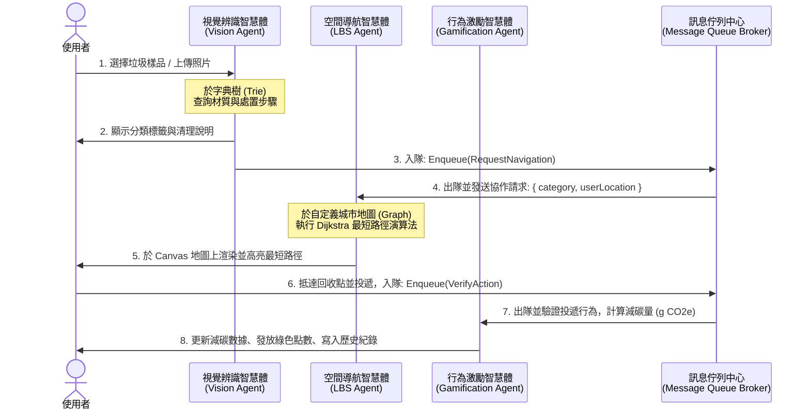

# EcoCatch 產品需求文件 (PRD)

## 1. 專案概述 (Project Overview)

### 1.1 專案背景
在現代都市生活中，垃圾分類與資源回收是永續發展的重要一環。然而，一般大眾在丟棄垃圾時，常面臨兩大痛點：
1. **分類知識模糊**：複合材質（如手搖飲塑膠杯、紙餐盒、鋁箔包）不易區分一般垃圾、塑膠回收或紙容器，導致回收率低且易造成後續處理困擾。
2. **回收設施難尋**：通勤路上常找不到對應的資源回收桶或智慧回收機（如 iTrash），使得民眾常需將垃圾攜帶在身，降低主動分類的意願。

### 1.2 專案目標
本專案名為 **EcoCatch**，是一個基於 **HTML/CSS/JS (Vanilla Web)** 運行的智慧垃圾分類與導航展示系統。系統採用**多智慧體協同 (Multi-Agent Collaboration)** 架構，並在核心功能中深度整合**資料結構與演算法**，以滿足學術期末專案與實用性的要求。本系統將：
* 模擬「隨手一拍」之視覺辨識，透過手寫 **字典樹 (Trie)** 進行分類檢索，快速引導正確分類。
* 使用 **自建地圖（圖形 Graph）** 與 **Dijkstra 最短路徑演算法**，為使用者規劃至最近適用回收點的導航路線，並提供**演算法單步執行視覺化（Algorithm Visualization）**以供口試演示。
* 透過 **行為激勵智慧體**，發放減碳積分，並利用 **佇列 (Queue)** 記錄歷史回收軌跡。

---

## 2. 目標使用者與痛點 (Target Persona)

| 使用者角色 | 核心痛點 | 期望解決方案 |
| :--- | :--- | :--- |
| **通勤外食族 (User A)** | 1. 垃圾與回收材質複雜，難以精確分類。<br>2. 外出時手拿垃圾，卻在街上找不到回收桶或垃圾桶，非常不便。 | 1. 用手機鏡頭隨手一拍/手動選擇即可辨識材質並獲得分類指引。<br>2. 自動定位並規劃前往最近回收點的步行路線。 |
| **精打細算小資族 (User B)** | 1. 傳統環保回收缺乏即時的物質與心理回饋。<br>2. 減碳行為難以量化，缺乏持續動力。 | 1. 正確投遞垃圾後，能即時累積減碳點數。<br>2. 點數可兌換實用的商家優惠券或通路點數。 |

---

## 3. 多智慧體協作架構 (Multi-Agent Architecture)

系統由三個核心 AI Agent 組成，在前端透過自訂的 **全域訊息中心 (Message Broker)** 與 **先進先出訊息佇列 (Message Queue)** 進行模擬非同步通訊與協同運作：



### 3.1 智慧體通訊協定定義
智慧體之間透過結構化 JSON 格式傳遞訊息，主要協議如下：

* **分類結果訊息 (VA -> LA)**:
  ```json
  {
    "sender": "VisionClassificationAgent",
    "receiver": "LBSSpatialNavigationAgent",
    "timestamp": 1779836400,
    "type": "REQUEST_NAVIGATION",
    "data": {
      "itemId": "pet_bottle_01",
      "category": "PlasticRecyclable",
      "userLocation": { "nodeId": "node_user_start" }
    }
  }
  ```
* **導航狀態訊息 (LA -> GA)**:
  ```json
  {
    "sender": "LBSSpatialNavigationAgent",
    "receiver": "GamificationRewardAgent",
    "timestamp": 1779836450,
    "type": "NAVIGATION_COMPLETED",
    "data": {
      "routeFound": true,
      "path": ["node_user_start", "node_int_3", "node_bin_plastic_5"],
      "destinationId": "node_bin_plastic_5",
      "distance": 320
    }
  }
  ```

---

## 4. 核心資料結構與演算法設計 (Data Structures & Algorithms)

為展現資料結構課程的實作深度，本專案將**完全由原生 JavaScript 手寫實現**以下資料結構與演算法，不依賴外部資料庫或第三方地圖庫：

### 4.1 垃圾分類字典樹 (Trie / Classification Tree)
* **應用場景**：垃圾關鍵字快速搜尋與材質細分結構。
* **設計原理**：
  * 當使用者輸入垃圾關鍵字（例如 `"寶特瓶"`、`"紙餐盒"`）時，系統使用 **Trie** 進行前綴匹配（Prefix Search），快速帶出匹配的垃圾項目。
  * 同時，每個垃圾項目連接著一個**樹狀分類層級 (Hierarchical Tree Node)**：
    * `Root` -> `可回收 (Recyclable)` / `一般垃圾 (Trash)` / `廚餘 (FoodWaste)`
    * `可回收` -> `塑膠 (Plastic)` / `紙類 (Paper)` / `金屬 (Metal)`
  * 葉子節點（Leaf Node）存放對應的清理指引（如：沖洗、壓扁）與減碳係數。
* **優勢**：相較於一般的 `if-else` 或線性搜尋，Trie 的前綴查詢效率為 $O(L)$（$L$ 為字串長度），適合高效率檢索。

### 4.2 自建城市地圖圖形結構 (Graph - Adjacency List)
* **應用場景**：自建城市街區地圖的拓撲結構。
* **設計原理**：
  * 以鄰接清單（Adjacency List）表示一個自定義的網格化城市地圖。
  * **頂點 (Vertex)**：代表地圖上的交叉路口、使用者當前位置、一般垃圾桶、塑膠回收桶、紙類回收桶及 iTrash 智慧回收機。每個頂點包含座標 $(x, y)$。
  * **邊 (Edge)**：代表道路，邊的權重（Weight）為兩點間的實際歐氏距離（Euclidean Distance）。
* **程式碼資料結構模型**：
  ```javascript
  class MapNode {
      constructor(id, label, x, y, type) {
          this.id = id;       // 節點唯一識別碼 (如 "node_1")
          this.label = label; // 節點名稱 (如 "路口A")
          this.x = x;         // Canvas 上的 X 座標
          this.y = y;         // Canvas 上的 Y 座標
          this.type = type;   // 節點類型: 'intersection', 'bin_general', 'bin_plastic', 'bin_paper', 'itrash'
      }
  }

  class MapGraph {
      constructor() {
          this.nodes = new Map(); // NodeID -> MapNode
          this.adjList = new Map(); // NodeID -> Array of { toNodeId, weight }
      }
      
      addNode(node) {
          this.nodes.set(node.id, node);
          this.adjList.set(node.id, []);
      }
      
      addEdge(fromId, toId, weight) {
          this.adjList.get(fromId).push({ toNodeId: toId, weight: weight });
          this.adjList.get(toId).push({ toNodeId: fromId, weight: weight }); // 無向圖
      }
  }
  ```

### 4.3 Dijkstra 最短路徑演算法與視覺化展示
* **應用場景**：空間導航智慧體計算從「使用者當前節點」至「最近的特定類型回收桶/機」的最短路線。
* **設計原理**：
  * 輸入：起點（使用者當前節點 ID）與目標垃圾類型（如 `bin_plastic` 或 `itrash`）。
  * 使用手寫的 **最小優先佇列 (Min-Priority Queue / Binary Heap)** 實作 Dijkstra 演算法。
  * **演算法視覺化模式（Algorithm Visualization Mode）**：
    * 支援「單步執行（Step-by-step）」與「連續動畫」模式。
    * 當演算法執行時，Canvas 上會動態改變節點與邊的顏色：
      * **灰色**：未探索節點/邊。
      * **黃色**：目前正在探索/鬆弛（Relax）中的頂點與相鄰邊。
      * **粉紅色/藍色**：已確定最短距離（Visited）的節點。
      * **綠色/高亮流光**：最終計算出的最短路徑。
* **複雜度**：$O((V + E) \log V)$。

### 4.4 歷史回收紀錄佇列 (FIFO Queue - Array-based)
* **應用場景**：使用者最近 5 筆回收歷史紀錄（先進先出）。
* **設計原理**：
  * 當發放點數成功時，將新紀錄 push 入佇列。
  * 若佇列大小超過 5，則執行 dequeue，自動擠出最舊的紀錄，維持資料在固定容量，並即時更新於 UI 歷史時間軸。

### 4.5 使用者資訊雜湊表 (Hash Table / JS Map)
* **應用場景**：
  * 儲存與快速查詢使用者帳戶資訊、點數餘額以及持有的折價券清單。

---

## 5. 網頁介面設計與功能模組 (Interface & Modules)

EcoCatch 將採用單頁應用程式 (SPA) 的視覺風格，具備精美、具科技感的現代暗黑主題 (Premium Dark Mode) 配色。

### 5.1 介面三大區塊
1. **控制面板與相機模擬區 (Control & Camera Module - 左側)**：
   * 模擬手機相機畫面，提供多種垃圾範本圖片供使用者點選（寶特瓶、手搖杯、紙便當盒、鋁箔包、一般果皮等）。
   * 點選後觸發「視覺辨識智慧體」的辨識動畫與分類結果顯示。
   * **Trie 樹互動查詢框**：一個文字輸入框，使用者可以輸入文字，系統會利用 Trie 樹即時聯想並顯示推薦垃圾項目。
2. **自建城市地圖畫布區 (Custom Map Canvas - 中間)**：
   * 使用 **HTML5 Canvas** 動態繪製自定義的街區網格與節點。
   * 以不同顏色與圖示標示各類垃圾桶及 iTrash 智慧回收機。
   * 使用者可以點擊地圖任意節點來「設定使用者當前位置」。
   * **演算法操作面板**：包含【尋找最近回收點】、【單步執行 Dijkstra】、【自動播放】、【重設演算法】等控制按鈕。
   * 當導航啟動時，以高亮流光動畫線條渲染 Dijkstra 演算法計算出的最短步行路徑。
3. **智慧體通訊日誌與積點面板 (Agent Terminal & Rewards - 右側)**：
   * **多智慧體 Debug 主機板 (Agent Message Dashboard)**：即時滾動顯示 Vision, LBS, Reward 智慧體之間傳遞的 JSON 通訊日誌，終端機（Terminal）打字機風格。
   * **個人減碳與福利社**：顯示累計減碳量、持有綠色點數，以及拉霸解鎖、兌換優惠券的趣味模組。

---

## 6. 非功能性需求 (Non-Functional Requirements)

* **免伺服器依賴 (Zero Server Dependency)**：
  * 所有資料結構（Trie, Graph, Priority Queue, Message Queue）與演算法完全在**瀏覽器端（Local Client-side）**以原生 JavaScript 記憶體操作實現。
  * 不需架設任何資料庫或執行 npm 伺服器，方便期末報告當場直接雙擊開啟 `index.html` 即可流暢示範。
* **流暢的動畫與互動**：
  * Canvas 地圖重繪幀率需達 30fps 以上，路徑渲染應具備平滑過渡或點狀流光效果。
  * 系統需支援 Mobile 觸控與響應式佈局。

---

## 7. 評分展示亮點 (Grading & Presentation Highlights)

針對期末專案口試，本設計特別強化了以下「能向教授展示的亮點」：
1. **Dijkstra 演算法執行過程視覺化**：教授可以親眼看到 Dijkstra 演算法如何在自建圖結構中一步步蔓延探索，並鬆弛鄰接邊，最後回溯找出綠色路徑的數學過程。
2. **手寫 Trie 樹互動檢視器**：網頁中內嵌一個「Trie 樹結構檢視分頁」，能以圖形化（如巢狀清單或樹狀節點）展示當前 Trie 記憶體中的狀態，證明手寫資料結構的真實性。
3. **Agent 通訊監控器**：即時印出帶有時間戳記的 JSON 訊息封包，展現多智慧體協作系統與訊息佇列的設計思維。
