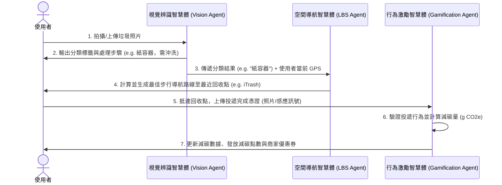

# EcoCatch 產品需求文件 (PRD)

## 1. 專案概述
* **專案名稱**：EcoCatch（隨手一拍、精準分類：基於多智慧體協同之智慧垃圾分類與幸福減碳地圖）
* **核心願景**：為解決通勤外食族「垃圾分類困難」與「路上難尋回收點」的痛點，結合小資族喜愛的「點數經濟」，打造一個結合 AI 視覺辨識、LBS 空間導航與遊戲化減碳激勵的智慧垃圾回收系統。
* **技術核心**：基於三大 AI 智慧體（Vision, LBS, Gamification）的協同運作，實現從「拍照辨識」到「實體導航」與「發放減碳福利」的閉環體驗。

---

## 2. 目標使用者與痛點 (Target Persona)

| 使用者角色 | 核心痛點 | 期望解決方案 |
| :--- | :--- | :--- |
| **通勤外食族 (User A)** | 1. 垃圾與回收材質複雜，難以精確分類。 2. 外出時手拿垃圾，卻在街上找不到回收桶或垃圾桶，非常不便。 | 1. 用手機鏡頭隨手一拍即可辨識材質並獲得分類指引。 2. 自動定位並規劃前往最近回收點的步行路線。 |
| **精打細算小資族 (User B)** | 1. 傳統環保回收缺乏即時的物質與心理回饋。 2. 減碳行為難以量化，缺乏持續動力。 | 1. 正確投遞垃圾後，能即時累積減碳點數。 2. 點數可兌換實用的商家優惠券或通路點數。 |

---

## 3. 多智慧體協作架構 (Multi-Agent Architecture)

本系統的核心在於以下三個 AI Agent 的即時資料串接與通訊：

### 智慧體規格說明
1. **視覺辨識智慧體 (Vision Classification Agent)**
   * **角色**：前端影像分析師
   * **輸入**：手機鏡頭拍攝之即時影像（或相簿照片）。
   * **輸出**：垃圾類別標籤（如：紙容器、塑膠瓶、一般垃圾）與對應的處理步驟（如：需沖洗並疊放）。
2. **空間導航智慧體 (LBS Spatial Navigation Agent)**
   * **角色**：地理資訊尋寶導航員
   * **輸入**：使用者 GPS 座標、目標垃圾類別（如：紙容器）。
   * **輸出**：最近的智慧回收機（iTrash）或公共回收點位置，並生成步行導航路線。
3. **行為激勵智慧體 (Gamification Reward Agent)**
   * **角色**：減碳積分審計師
   * **輸入**：投遞完成憑證（如回收機感應訊號或拍照確認）。
   * **輸出**：更新使用者減碳資料庫、發放減碳點數，並推送合作商家優惠券。

---

## 4. 系統功能需求 (Functional Requirements)

### 4.1 智慧影像辨識模組
* **相機/照片上傳功能**：支援調用手機鏡頭進行即時拍攝，或從相簿選擇照片。
* **AI 材質辨識**：自動識別圖像中的物體（如手搖杯、紙便當盒、鋁罐），判斷其分類類別。
* **分類指引顯示**：提供該類別的正確處理步驟（例如：「請先沖洗並壓扁」、「請撕下外包裝膠帶」）。

### 4.2 LBS 地圖導航模組
* **GPS 定位**：獲取使用者當前的經緯度位置。
* **回收站點檢索**：根據辨識出的垃圾類別，篩選周邊支援該類別的回收點（如智慧回收機 iTrash、學校/社區回收站、公共回收桶）。
* **路徑規劃**：在畫面上顯示步行導航路線、預估步行時間與距離。

### 4.3 行為驗證與獎勵模組
* **投遞驗證**：
  * *方式 A (模擬串接)*：模擬與 iTrash 回收機的 API 串接，接收投遞成功訊號。
  * *方式 B (照片驗證)*：使用者拍攝投遞垃圾時的照片（例如手持垃圾放入回收口的瞬間），進行二次檢驗。
* **減碳量計算**：依據投遞的垃圾材質與數量，換算減碳克數（g CO2e）。
* **點數發放**：每次投遞成功，發放相應的「綠色點數」並寫入資料庫。

### 4.4 減碳點數商城
* **優惠券列表**：展示合作商家的優惠券（如超商咖啡折價券、綠色商店折扣碼、大眾運輸乘車券）。
* **點數兌換流程**：使用者點擊兌換，扣除對應點數並產生兌換條碼/優惠序號。
* **我的背包/錢包**：儲存使用者已兌換但尚未使用的優惠券。

### 4.5 個人減碳成就儀表板
* **累計數據展示**：累計減碳量（Kg CO2e）、累計投遞次數、目前持有綠色點數。
* **減碳具體化趣味類比**：例如：「您累計的減碳量相當於為地球種植了 3 棵樹」、「相當於少開車 50 公里」。
* **回收歷史紀錄**：條列每一次的回收時間、類別、回收點與獲得的點數。

---

## 5. 資訊架構與頁面規劃 (Sitemap & Page Layout)

為了符合現代、美觀且具備動態感的 UI 設計，我們規劃了以下 **5 個核心頁面**：

### 5.1 頁面 1：智慧掃描首頁 (Home / Scan Page)
* **UI 設計重點**：
  * 採用極簡且科技感的玻璃帷幕 (Glassmorphism) 設計，背景為漸層綠/藍色系，凸顯環保與科技感。
  * 畫面中心為大面積的 **「AI 掃描鏡頭預覽區」**，並有動態雷達掃描波紋。
  * 底部提供三個快捷按鈕：【拍照辨識】、【手動選擇類別】、【開啟相簿】。
  * 頂部顯示簡潔的個人狀態列（目前點數、今日已減碳量）。
* **互動流程**：
  1. 使用者點擊拍照，系統進行 AI 辨識。
  2. 辨識完成後，從底部彈出 **「辨識結果卡片」**（Bottom Sheet），顯示：
     * 材質類別標籤（如：紙容器 ♻️）
     * 處理建議（如：沖洗 -> 壓扁 -> 投遞）
     * 按鈕：【尋找最近回收點】（點擊後無縫切換至地圖頁）

### 5.2 頁面 2：幸福減碳地圖頁 (Eco Map Page)
* **UI 設計重點**：
  * 全螢幕地圖（可整合 Mapbox 或 Google Maps 樣式，調整為深色/綠色主題）。
  * 地圖上以不同顏色的 Pin 標示各類回收點（例如：綠色為 iTrash 回收機、藍色為公共資源回收桶）。
  * 點擊 Pin 會顯示氣泡卡片，說明該站點的「可回收項目」、「營業時間」與「目前擁擠程度/剩餘容量」。
* **互動流程**：
  1. 系統自動在地圖上繪製從「當前位置」到「選定回收點」的步行導航路線。
  2. 底部顯示導航資訊卡片：距離 250 公尺、步行約 3 分鐘，並有【開始導航】與【抵達並驗證投遞】按鈕。

### 5.3 頁面 3：投遞驗證與獎勵動畫頁 (Verification & Reward Page)
* **UI 設計重點**：
  * 當使用者到達回收點並點擊【抵達並驗證投遞】時進入。
  * 提供「模擬投遞成功」或「上傳投遞照片」介面。
  * **視覺亮點**：驗證成功後，播放精緻的微動畫（例如：綠色能量匯聚、繽紛紙屑灑落效果）。
* **顯示資訊**：
  * 「投遞成功！」大標題。
  * 獲得點數：`+50 點`。
  * 減碳貢獻：`+120g CO2e`。
  * 按鈕：【查看減碳成就】、【前往福利社】。

### 5.4 頁面 4：減碳福利社 (Eco Shop / Reward Center Page)
* **UI 設計重點**：
  * 頂部展示使用者當前可用點數（以大字體及動態浮動泡泡呈現）。
  * 下方為卡片式排列的優惠券列表，分為「熱門推薦」、「超商美食」、「綠色出行」、「生活百貨」等分類標籤（Tabs）。
  * 每張優惠券卡片包含：商家 Logo、優惠內容（如：拿鐵咖啡折 10 元）、所需點數、剩餘數量進度條。
* **互動流程**：
  1. 點擊優惠券卡片彈出確認兌換視窗。
  2. 兌換成功後，卡片存入「我的優惠券」分頁，並可點擊出示 QR Code 進行實體核銷。

### 5.5 頁面 5：個人減碳儀表板 (Dashboard & Profile Page)
* **UI 設計重點**：
  * 採用資訊圖表（Infographics）視覺呈現，以環形進度條或折線圖展示使用者的減碳成長趨勢。
  * **幸福減碳森林**：畫面上有一棵會隨著累計減碳量成長的虛擬小樹，吸引使用者持續回收。
  * 歷史紀錄列表：以時間軸（Timeline）樣式呈現，清晰易讀。

---

## 6. 非功能性需求 (Non-Functional Requirements)

* **載入速度 (Performance)**：
  * AI 圖像辨識反應時間應在 1.5 秒內完成。
  * 地圖載入與路線規劃應在 1 秒內渲染完畢。
* **行動端優先 (Mobile Responsive)**：
  * 因使用者多在戶外通勤使用，系統必須針對 Mobile 螢幕（iOS/Android 瀏覽器）進行高度優化，按鈕必須易於單手點擊。
* **離線與容錯機制**：
  * 若 GPS 訊號不佳，應允許使用者在地圖上進行手動微調定位。
  * 若辨識失敗，提供手動搜尋/分類選項，確保流程不中斷。

---

## 7. 開發優先順序 (Roadmap / Phase 1 Scope)

由於是期末專案，建議第一階段（MVP）聚焦於**核心故事的完整閉環**：
1. **MVP 核心功能**：
   * 模擬 AI 辨識（可拍照，並預設幾種常見垃圾如「寶特瓶」、「紙餐盒」進行辨識結果演示）。
   * LBS 模擬導航（使用模擬的 GPS 與回收站位置，繪製路線）。
   * 減碳點數累積與模擬兌換（基本點數加減與優惠券生成）。
2. **第二階段**：
   * 真實 AI 影像模型介接。
   * Google Maps API / Mapbox API 實時定位與導航。
   * 真實商家 API 優惠券兌換系統串接。
